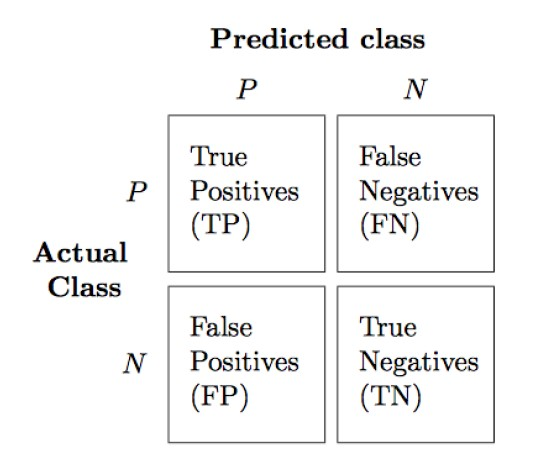

# Linear Regression

## Hypothesis: 
### Una feature
$$
h_{\theta}(x_{1})=\theta_{0}+\theta_{1}x_{1}
$$
### Multiple features:
$$
h_{\theta}(x^{(i)})=\theta_{0}+\theta_{1}x_{1}+...+\theta_{i}x_{i}
$$

## Cost function
$$
J(\theta_{0}, \theta{1})=\frac{1}{2m}\sum_{i=1}^{m}(h_{\theta}(x^{(i)})-y^{(i)})^2
$$

## Gradient Descent Algorithm

$$
\begin{align}
\theta_{0} := \theta_{0} - \alpha\frac{1}{m}\sum_{i=1}^{m}(h_{\theta}(x^{(i)})-y^{(i)})\\
\theta_{1} := \theta_{1} - \alpha\frac{1}{m}\sum_{i=1}^{m}(h_{\theta}(x^{(i)})-y^{(i)})\cdot x_{j}^{(i)}
\end{align}
$$
## Mean Normalization

$$
x^{'}_{i}=\frac{x_{i}-\mu_{i}}{\sigma_{i}}
$$
$\mu$ e $\sigma$ sono da calcolare con i dati del **training set.**

## MinMax Normalization

$$
 x^{'}_{i} = \frac{x_{i} - \min(x)}{\max(x)-\min(x)}
$$

## Polynomial regression

$$
\begin{align}
h_{\theta}(x)=\theta_{0}+\theta_{1}x_{1}+\theta_{2}x_{2}+\theta_{3}x_{3} = \theta_{0}+\theta_{1}(size)+\theta_{2}(size)^{2}+\theta_{3}(size)^{3}\\
x{1}=(size)\\
x{2}=(size)^{2}\\
x{3}=(size)^{3}
\end{align}
$$

## Pearson Correlation Coefficient

$$
\rho=\frac{1}{N-1}\sum_{i=1}^{N}(\frac{X_{i}-\mu_{x}}{\sigma_{X}})(\frac{Y_{i}-\mu_{Y}}{\sigma_{Y}})
$$

# Logistic Regression

## Sigmoid Function

$$
g(z)=\frac{1}{1+e^{-z}}
$$
La funzione $g(z)>0.5$ quando $z>0$

## Hypothesis

$$
\begin{aligned}
h_{\theta}(x)=g(\theta^{T}x)=\frac{1}{1+e^{-\theta^{T}x}}\\
h_{\theta}(x)\geq0.5\rightarrow \textrm{"}1\textrm{"}\\
h_{\theta}(x)<0.5\rightarrow \textrm{"}0\textrm{"}
\end{aligned}
$$

## Cost Function

$$
\begin{align}
J(\theta)=\frac{1}{m}\sum_{i=1}{m}\textrm{Cost}(h_{\theta}(x),y)\\
\textrm{Cost}(h_{\theta}(x),y)=-y\log(h_{\theta}(x))-(1-y)\log(1-h_{\theta(x)})
\end{align}
$$
## Linear Decision Boundary

### Caso 2D
$$
\begin{aligned}
h_{\theta}(x)=g(\theta_{0}+\theta_{1}x_{1}+\theta_{2}x_{2})\\
\theta=[\theta_{0},\theta_{1},\theta_{2}]^{T}\;\;x=[1,x_{1},x_{2}]^{T}
\end{aligned}
$$
## No-linear Decision Boundary

$$
h_{\theta}(x)=g(\theta_{0}+\theta_{1}x_{1}+\theta_{2}x_{2}+\theta_{3}x_{1}^{2}+\theta_{4}x_{2}^{2})
$$
$$
\theta=[-1\;0\;0\;1\;1]
$$
Quindi il decision boundary è
$$
h_{\theta}(x)=\theta_{0}+\theta_{1}x_{1}+\theta_{2}x_{2}+\theta_{3}x_{1}^{2}+\theta_{4}x_{2}^{2}=-1+x_{1}^{2}+x_{2}^{2}
$$

# Metrics

## Confusion matrix

## Accuracy

$$
\textrm{Accuracy}=\frac{TP+TN}{FP+FN+TP+TN}
$$

## Performance metrics from a confusion matrix

### F-Score: media armonica della precisione e richiamo

$$
\textrm{F-Score}=2\cdot\frac{P\cdot R}{P+R}
$$
### Precision
Indica la **percentuale di risultati rilevanti** tra tutti quelli che il modello ha identificato come positivi.
$$
P=\frac{TP}{TP+FP}
$$
### Recall
Indica la **percentuale di risultati rilevanti trovati** rispetto al totale dei risultati effettivamente rilevanti.
$$
R=\frac{TP}{FN+TP}
$$

# Working with Text Data

## Bag of words (Example)
### Training Set:
+ The sun is shining
+ The weather is sweet
+ The sun is shining, the weather is sweet, and one and one is two
### Vocabulary
+ {'and': 0, {'and’: 0, 'is': 1, 'one': 2, 'shining': 3, 'sun': 4, 'sweet': 5, 'the': 6, 'two': 7’, 'weather':8}
### Bag of Word representation

+ $[0\;1\;0\;1\;1\;0\;1\;0\;0]$
+ $[0\;1\;0\;0\;0\;1\;1\;0\;1]$
+ $[2\;3\;2\;1\;1\;1\;2\;1\;1]$

In questo caso la parola **'is'** occorre in tutte e tre le frasi (basta vedere le colonne dove i numeri sono tutti $> 0$)

## TF-IDF
Serve per valutare quanto è importante una parola all'interno di un documento in relazione ad un insieme di documenti.
+ **TF:** misura quante volte una parola compare in un documento. L'idea è che più una parola appare in un documento, più potrebbe essere importante per quel documento.
+ **IDF:** riduce il peso delle parole molto comuni come "il", "e", "ma", che appaiono in molti documenti e quindi non sono utili per distinguere i contenuti.

$$
tfidf(w,d)=tf\cdot\left(\ln\left(\frac{N+1}{N_{w}+1}\right)+1\right)
$$

+ $N=$ numero di documenti nel **training set**
+ $N_{w}=$ numero di documenti nel training set in cui appare la parola $w$
+ $tf=$ Term Frequency (numero di volte in cui $w$ appare nel documento $d$)

Eseguendo TF-IDF per tutte le parole del Bag of Words avrò un vettore $v$ che si deve normalizzare:
$$
v_{norm}=\frac{v}{||v||_{2}}=\frac{v}{\sqrt{v_{1}^{2}+v_{2}^{2}+...+v_{n}^{2}}}
$$

# Holdout method and Regularization

## Regularization: Ridge regression

$$
J(\theta)=\frac{1}{2m}\left[\sum_{i=1}^{m}(h_{\theta}(x^{(i)})-y^{(i)})^{2}+\lambda\sum_{j=1}^{n}\theta_{j}^{2}\right]\\
$$
$$
\min J(\theta)
$$

## Bias/variance as function of the regularization parameter $\lambda$

### Minimization problem of $J(\theta)$

$$
J(\theta)=\frac{1}{2m}\left[\sum_{i=1}^{m}(h_{\theta}(x^{(i)})-y^{(i)})^{2}+\lambda\sum_{j=1}^{n}\theta_{j}^{2}\right]=\frac{1}{2m}\left[\sum_{i=1}^{m}Cost(h_{\theta}(x),y)+\lambda\sum_{j=1}^{n}\theta_{j}^{2}\right]
$$
$$
Cost(h_{\theta}(x),y)=(h_{\theta}(x^{(i)})-y^{(i)})^{2}
$$

### After the minimization
$$
J_{train}(\theta)=\frac{1}{m_{train}}\left[\sum_{i=1}^{m_{train}}Cost(h_{\theta}(x),y)\right]
$$
$$
J_{vs}(\theta)=\frac{1}{m_{vs}}\left[\sum_{i=1}^{m_{vs}}Cost(h_{\theta}(x),y)\right]
$$
## Regularization: Logistic Regression

### Minimization

$$
J(\theta)=\frac{1}{m}\left[\sum_{i=1}^{m}Cost(h_{\theta}(x),y)+\frac{\lambda}{2}\sum_{j=1}^{n}\theta_{j}^{2}\right]
$$

Invece di usare $\lambda$, alcune implementazioni usano $C=\frac{1}{\lambda}$
$$
J(\theta)=\frac{1}{m}\left[C\sum_{i=1}^{m}Cost(h_{\theta}(x),y)+\frac{1}{2}\sum_{j=1}^{n}\theta_{j}^{2}\right]
$$

# Neural Networks

![[Immagine 2025-06-04 103910.jpg]]
+ $a^{[j]}=$ funzione di attivazione per il **layer** $j$
+ $W^{[j]}=$ matrice dei pesi che regola la funzione di attivazione tra il layer $j-1$ e il layer $j$
+ $b^{[j]}$

#### Esempio relativo all'immagine:

$$
z^{[1]}=W^{[1]}x+b^{[1]}
$$

+ $z^{[1]}$ ha una dimensione $(4,1)$

+ $W^{[1]}$ ha dimensione $(4,3)$

+ $x$ ha dimensione $(3,1)$

+ $b^{1}$ ha dimensione $(4,1)$

$$
a^{[1]}=g(z^{[1]})
$$

+ $a^{[1]}$ ha dimensione $(4,1)$

+ $g(z^{[1]})$ ha dimensione $(4,1)$

$$
z^{[2]}=W^{[2]}a^{[1]}+b^{[2]}
$$

+ $z^{[2]}$ ha una dimensione $(1,1)$

+ $W^{[2]}$ ha dimensione $(1,4)$

+ $a^{[1]}$ ha dimensione $(4,1)$

+ $b^{2}$ ha dimensione $(1,1)$

$$
a^{[2]}=g(z^{[2]})
$$

+ $a^{[1]}$ ha dimensione $(1,1)$

+ $g(z^{[2]})$ ha dimensione $(1,1)$

## ReLU
$$
R(z)=max(0,z)
$$
## Loss Functions
$$
L(W,b)=\frac{1}{m}\sum_{i=1}^{m}-y^{[i]}(\log(h_{W,b}(x^{[i]})-(1-y^{[i]})\log(1-h_{W,b}(x^{[i]})))
$$

$m=$ numero di esempi nel training set

#### Per la regressione si utilizza il Mean Squarred error loss
$$
L(W,b)=\frac{1}{m}\sum_{i=1}^{m}(h_{W,b}(x^{[i]})-y^{[i]})^{2}
$$

## Softmax layer

Di solito, nella classificazione multiclasse, l'ultimo layer di solito usa una Softmax Activation.
Questo vuol dire che la rete darà in output la distribuzione di probabilità su tutta la classe
$$
z^{[i]}=W^{[i]}a^{[i-1]}+b^{i}
$$
Il layer Softmax risulta:
$$
a^{[i]}=\frac{e^{z^{[i]}}}{\sum_{j=1}^{N}e^{z^{[i]}}}
$$
## Cross-Entropy Loss
Usata per quantificare la differenza tra due distribuzioni di probabilità.
Di solito, la distribuzione "vera" (quella che il modello di apprendimento automatico cerca di prevedere) è rappresentata come **one-hot encoding**, ovvero un vettore in cui solo la posizione corrispondente alla classe corretta ha valore 1, mentre le altre sono 0.
$$
L(W,b)=-\sum_{i=1}^{m}y^{[i]}\log(h_{W,b}(x^{[i]}))
$$
+ $m$ è il numero dei campioni del **training**
+ $y^{(i)}$ è la distribuzione reale per il campione $i$, sotto forma di vettore **one-hot**
+ $h_{W,b}(x^{[i]})$ è la distribuzione di probabilità predetta dalla rete neurale per l'input $x^{(i)}$
+ $W,b$ rappresentano i pesi e i bias della rete

# SVM

L’obiettivo principale di una SVM è trovare **l’iperpiano ottimale** che separa i dati in classi diverse con il **margine più ampio possibile**.

---
Hai due tipi di punti su un piano (dati 2D): rossi e blu. Vuoi trovare una linea che li separi.

- Ci sono tante linee possibili, ma la SVM sceglierà **quella che massimizza la distanza** tra la linea e i punti più vicini di ciascuna classe.
- Questi punti vicini si chiamano **vettori di supporto** (_support vectors_), da cui il nome.
---

$$
w^{T}x_{i}+b\geq 1\;\textrm{per}\;y_{i}=+1
$$

$$
w^{T}x_{i}+b\leq -1\;\textrm{per}\;y_{i}=-1
$$

Equazioni combinate:
$$
y_{i}(w^{T}x_{i}+b)\geq 1\; \forall\:x_{i}
$$
## Margini
$$
\begin{aligned}
w^{T}x_{i}+b=1\\
w^{T}x_{i}+b=-1
\end{aligned}
$$
### Vettore perpendicolare del Decision Boundary

Prendiamo due punti $x_{1}$ e $x_{2}$ che passano sulla retta $w^{T}x+b=0$

$$
\begin{aligned}
w^{T}x_{1}+b=0\\
w^{T}x_{2}+b=0
\end{aligned}
$$

Equazioni combinate:

$$
w^{T}(x_{1}-x_{2})=0
$$

### Larghezza del margine

+ Sia $\mathbf{x}_1$ un punto sull'iperpiano $\mathbf{w}^T \mathbf{x} + b = -1$. Cerchiamo il punto più vicino sull'altro iperpiano, ovvero:

$$
\mathbf{w}^T \mathbf{x}_2 + b = 1
$$

+ Supponiamo che $\mathbf{x}_2$ sia ottenuto muovendosi da $\mathbf{x}_1$ lungo la direzione di $\mathbf{w}$, quindi:

$$
\mathbf{x}_2 = \mathbf{x}_1 + \lambda \mathbf{w} \Rightarrow \mathbf{w}^T (\mathbf{x}_1 + \lambda \mathbf{w}) + b = 1
$$

+ Sviluppiamo il prodotto scalare:

$$
\mathbf{w}^T \mathbf{x}_1 + b + \lambda \mathbf{w}^T \mathbf{w} = 1
$$

+ Poiché sappiamo che $\mathbf{w}^T \mathbf{x}_1 + b = -1$, sostituiamo:

$$
-1 + \lambda \mathbf{w}^T \mathbf{w} = 1
$$

+ Risolvendo per $\lambda$:

$$
\lambda \mathbf{w}^T \mathbf{w} = 2 \Rightarrow \lambda = \frac{2}{\mathbf{w}^T \mathbf{w}}
$$

+ La distanza tra i due punti $\mathbf{x}_1$ e $\mathbf{x}_2$, ovvero il margine, è:

$$
\lambda||w||=\frac{2}{||w||^{2}}||w||=\frac{2}{||w||}=\frac{2}{\sqrt{w^{T}w}}
$$
+ Vogliamo massimizzare $\frac{2}{\sqrt{w^{T}w}}$
+ Equivale a minimizzare $\frac{\sqrt{w^{T}w}}{2}$
+ Che è equivalente a $\frac{w^{T}w}{2}$

## SVM Cost Function

### Separabilità lineare:
$$
\min_{w,b}\frac{w^{T}w}{2}
$$

### Casi non separabili linearmente:

Per gestire questi casi, si **ammorbidisce il margine** introducendo delle **variabili di slack** $\epsilon_i$, una per ogni punto $\mathbf{x}_i$.

Ogni $\epsilon_i \geq 0$ rappresenta **quanto** quel punto **viola il margine**:

- $\epsilon_i = 0$: punto correttamente classificato e **fuori dal margine**.
    
- $0 < \epsilon_i < 1$: punto **dentro il margine** ma ancora sul lato corretto dell'iperpiano.
    
- $\epsilon_i > 1$: punto **classificato male** (cioè dal lato sbagliato dell'iperpiano).

### Funzione di costo (soft-margin SVM)

Con l'introduzione delle **slack variables** $\epsilon_i$, il problema di ottimizzazione diventa:
#### Funzione da minimizzare:
$$
\min_{⁡w,b}\left(\frac{w^{T}w}{2}+C\sum_{i}\epsilon_{i}\right)
$$
- La prima parte $\frac{\mathbf{w}^T \mathbf{w}}{2}$ serve a **massimizzare il margine** tra le classi (come nella SVM standard).
    
- La seconda parte $C \sum_i \epsilon_i$ penalizza le **violazioni del margine** (cioè gli errori o punti classificati male).
    
- Il parametro $C$ controlla il compromesso tra margine ampio e tolleranza agli errori:
    
    - **$C$ grande** → penalizza fortemente le violazioni → modello **rigido**.
        
    - **$C$ piccolo** → tollera violazioni → modello **più flessibile**.

#### Vincoli:

$$
y_{i}(w^{T}x_{i}+b)\geq 1−\epsilon_{i}\;\textrm{ e }\;\epsilon_{i}\geq 0\;\;\forall\:i
$$

Quindi:
- Ogni punto può violare il margine, ma la **somma totale** di tutte le violazioni viene **penalizzata** nella funzione obiettivo.

## SVM con Kernel
Le SVM con kernel possono computare decision boundary **non lineari**.

### Kernel gaussiani

Data $x$ computa nuove feature che dipendono dalla vicinanza ai **landmarks** $l^{(1)},l^{(2)},l^{(3)}$.

$$
f_{1}=similarity(x,l^{1})=\exp\left(-\frac{||x-l^{(1)}||^{2}}{2\sigma^{2}}\right)
$$

$$
f_{2}=similarity(x,l^{2})=\exp\left(-\frac{||x-l^{(2)}||^{2}}{2\sigma^{2}}\right)
$$

$$
f_{3}=similarity(x,l^{3})=\exp\left(-\frac{||x-l^{(3)}||^{2}}{2\sigma^{2}}\right)
$$

Se, per esempio, $\textrm{if} \; x\approx l^{(1)}\rightarrow f_{1}\approx1\;f_{2}\approx 0 \;f_{3}\approx 0$.

### Feature space
Con il kernel il Decision Boundary si basa sulle nuove feature $f_{1},f_{2},f_{3}$.

$$
\theta_{0}+\theta_{1}f_{1}+\theta_{2}f_{2}+\theta_{3}f_{3}\geq 0
$$

Supponendo che otteniamo questi valori:
$$
\theta_{0}=-0.5;\;\theta_{1}=1;\;\theta_{2}=1;\;\theta_{3}=0
$$

$$
x_{1}\rightarrow f_{1}\approx 1;\; f_{2}\approx 0;\; f_{3}\approx 0\rightarrow −0.5 + 1 ∗ 1 + 1 ∗ 0 + 0 ∗ 0\geq 0\rightarrow −0.5 + 1 = 0.5 \geq 0 \rightarrow 𝒚 = 𝟏
$$

$$
x_{2}\rightarrow f_{1}\approx 0;\; f_{2}\approx 1;\; f_{3}\approx 0\rightarrow −0.5 + 1 \geq 0 = 0.5 \geq 0 \rightarrow y = 𝟏
$$

$$
x_{3}\rightarrow f_{1}\approx 0;\; f_{2}\approx 0;\; f_{3}\approx 0\rightarrow −0.5 < 0 \rightarrow y =0
$$

